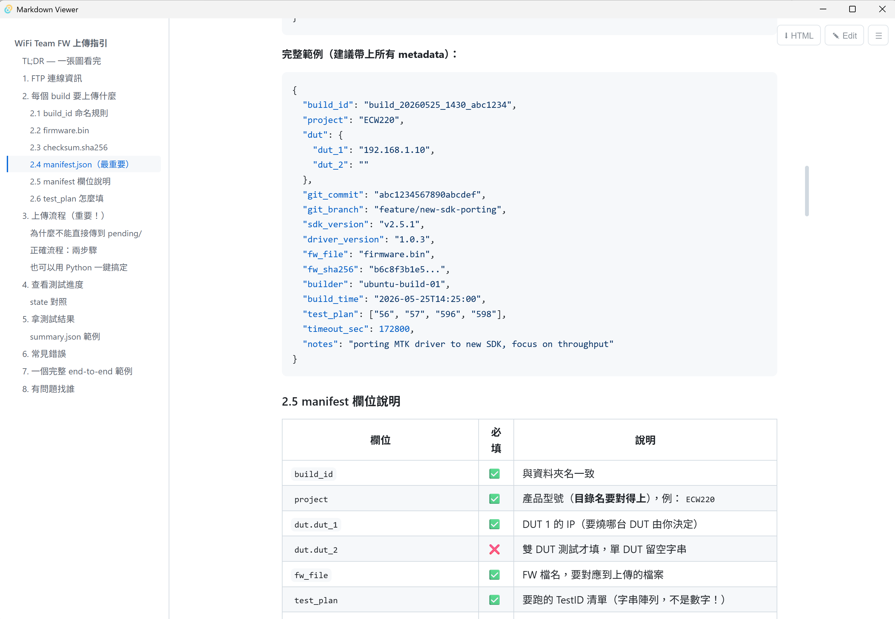
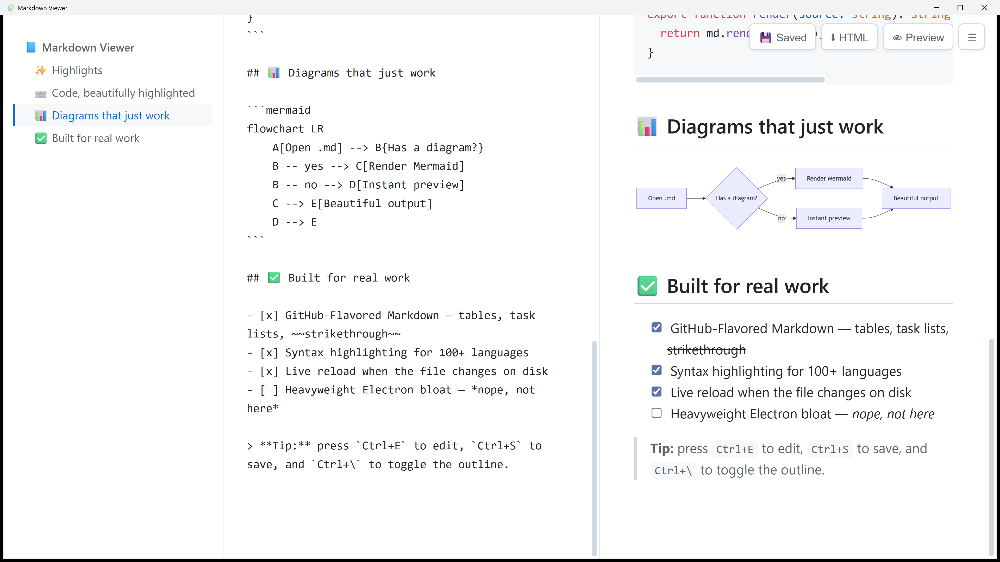

# Markdown Viewer

A **lightweight, fully-local Markdown viewer & editor** for Windows. Built with
**Tauri v2**, it uses Windows' built-in WebView2 instead of bundling Chromium —
so the whole app is a single portable exe of about **4 MB** and idle memory stays
around **30–60 MB**.

Open a `.md` file and it renders instantly — with a navigable outline, syntax
highlighting, Mermaid diagrams, a built-in editor with live preview, and
one-click export to a self-contained HTML file. No installer, no cloud, no
telemetry. Everything runs offline.

## Screenshots

### Reading mode — outline + rendered Markdown

The left **outline (TOC)** is generated from the document's headings; click any
entry to jump, and it highlights the section you're currently reading.



### Editing mode — live edit & preview

Press **Edit** (or `Ctrl+E`) to open the split editor. The preview updates as you
type, the two panes **scroll together**, and `Ctrl+S` saves back to disk.



## Features

- **GFM** rendering — tables, task lists, strikethrough (`markdown-it`)
- **Syntax highlighting** for code blocks (`highlight.js`)
- **Mermaid diagrams** — loaded lazily, only when a document actually contains a
  ` ```mermaid ` block, so plain documents pay nothing for it
- **Outline / TOC sidebar** — auto-built from headings, scroll-spy highlighting,
  collapsible with `Ctrl+\`
- **Live edit & preview** — split editor with synced scrolling (`Ctrl+E`),
  save with `Ctrl+S`, and an unsaved-changes prompt on close
- **Export to HTML** — produces a single self-contained `.html` next to your file,
  including the outline sidebar, highlighted code and inline Mermaid SVGs
- **Live reload** — the open file is watched on disk and re-rendered on save
- **Open with** — pick `markdown-viewer.exe` in Windows' "Open with" dialog for `.md` files
- **Drag & drop** a Markdown file onto the window
- **Find in document** (`Ctrl+F`), **open-file dialog** (`Ctrl+O`) and a **recent-files** list
- **YAML front matter** — the leading `---...---` block renders as a clean metadata card (title, description, date, tags, draft badge) instead of broken rules
- **Local relative-path images** — `` resolves and displays
- **Safe** — rendered HTML is sanitized with DOMPurify under a strict CSP, so opening an untrusted document won't run malicious scripts
- Light / dark theme — follows the OS setting or can be toggled manually
- **Remembers the window** — size, position and maximized state are saved on
  every move / resize and restored on the next launch
- External links open in your default browser

## Download

Grab `markdown-viewer.exe` from this repository's **Releases** page. It's a
single portable exe (Windows x64) — no installer, just download and run it.

> The portable exe doesn't register a file association. To open `.md` files
> with a double-click, right-click a `.md` file → **Open with** → **Choose
> another app** → browse to `markdown-viewer.exe` and tick "Always use this app".
>
> It requires the **Microsoft Edge WebView2 Runtime**, which is preinstalled on
> Windows 11 and on up-to-date Windows 10. On editions without it (e.g. Windows
> 10 LTSC), install the "Evergreen" runtime from Microsoft's WebView2 page.

### Antivirus false positive (Windows)

This is open-source software and the exe is **not code-signed yet**, so Windows
Defender or SmartScreen may occasionally flag it as a "potentially unwanted
program (PUA)" such as `Program:Win32/Wacapew.A!ml`. This is a **false positive**,
not actual malware — the `!ml` suffix means it's a machine-learning *heuristic*
guess, not a signature match.

- Every binary is built by GitHub Actions straight from public source. You can
  verify any exe yourself on [VirusTotal](https://www.virustotal.com) (a typical
  false positive shows only a few of dozens of engines flagging it, all with
  heuristic names like `!ml` / `PUA` / `Generic`).
- If blocked, choose **Allow / Restore** in the notification, or restore it under
  **Windows Security → Virus & threat protection → Protection history**.

## Keyboard shortcuts

| Shortcut | Action |
| --- | --- |
| `Ctrl+O` | Open a file |
| `Ctrl+F` | Find in document |
| `Ctrl+E` | Toggle edit / preview |
| `Ctrl+S` | Save |
| `Ctrl+W` / `Esc` | Close the window (asks to save if there are unsaved changes; `Esc` first closes any open dialog / find bar) |
| `Ctrl+\` | Toggle outline sidebar |
| `Ctrl+Shift+\` | Toggle wide / narrow content |
| `Ctrl+B` | Toggle file explorer |
| `Ctrl++` / `Ctrl+-` | Increase / decrease font size (or the `A+` / `A−` buttons) |

## Launch flags

```bash
markdown-viewer.exe file.md            # open and render
markdown-viewer.exe file.md --edit     # open straight into edit mode
markdown-viewer.exe file.md --zoom=1.5 # scale the whole UI (high-DPI / accessibility)
```

## Build with GitHub Actions (no local Node/Rust needed)

The workflow builds **only** the portable Windows exe — no installers, no zip,
no other platforms — and publishes it as a GitHub Release:

- **Run it manually** — *Actions → release → Run workflow*. It creates the
  release `v<version>` (e.g. `v1.5.0`, taken from `src-tauri/tauri.conf.json`)
  with `markdown-viewer.exe` attached. Running it again replaces the exe.
- **Or push a version tag** (`v1.5.0`) — same result; the tag must match the
  app version.

To release a new version, change the version in `package.json`,
`src-tauri/Cargo.toml` and `src-tauri/tauri.conf.json` (keep them the same) and
run the workflow. See [.github/workflows/release.yml](.github/workflows/release.yml).

## Build locally (optional)

Requires Node.js and Rust (MSVC toolchain):

```bash
npm install
npm run tauri build
```

Output: `src-tauri/target/release/markdown-viewer.exe` (no installers are produced).
For development with hot reload use `npm run tauri dev`.
